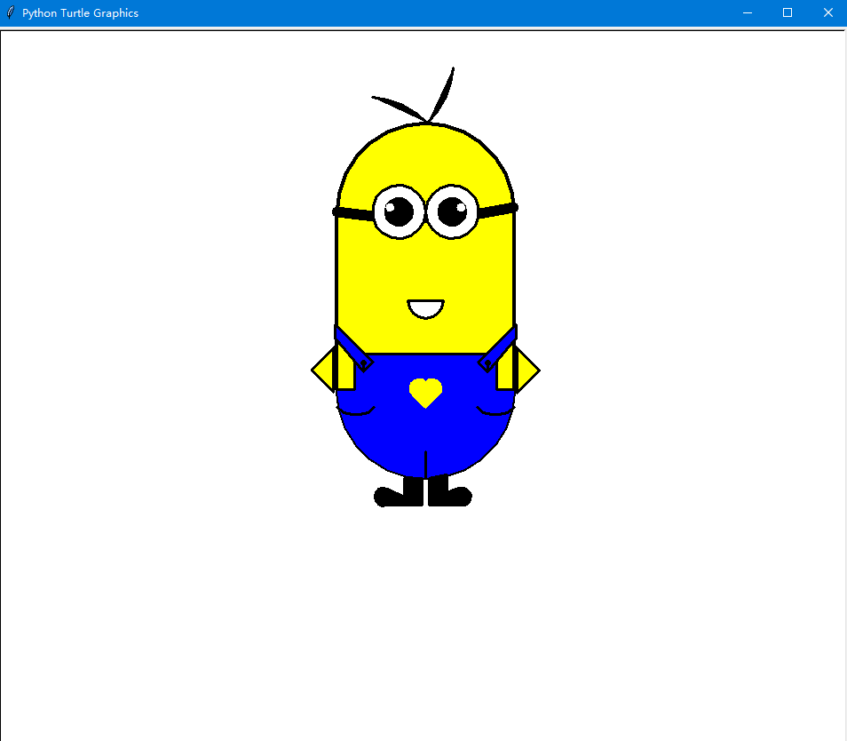

## 冰墩墩


>
>```py
>
>#冰墩墩
>import turtle
>
>turtle.title('懒羊羊python冰墩墩演示')
>
>turtle.speed(33)
>
># 左手
>turtle.penup()
>turtle.goto(177, 112)
>turtle.pencolor("lightgray")
>turtle.pensize(3)
>turtle.fillcolor("white")
>turtle.begin_fill()
>turtle.pendown()
>turtle.setheading(80)
>turtle.circle(-45, 200)
>turtle.circle(-300, 23)
>turtle.end_fill()
>
># 左手内
>turtle.penup()
>turtle.goto(182, 95)
>turtle.pencolor("black")
>turtle.pensize(1)
>turtle.fillcolor("black")
>turtle.begin_fill()
>turtle.setheading(95)
>turtle.pendown()
>turtle.circle(-37, 160)
>turtle.circle(-20, 50)
>turtle.circle(-200, 30)
>turtle.end_fill()
># 轮廓
># 头顶
>turtle.penup()
>turtle.goto(-73, 230)
>turtle.pencolor("lightgray")
>turtle.pensize(3)
>turtle.fillcolor("white")
>turtle.begin_fill()
>turtle.pendown()
>turtle.setheading(20)
>turtle.circle(-250, 35)
># 左耳
>turtle.setheading(50)
>turtle.circle(-42, 180)
># 左侧
>turtle.setheading(-50)
>turtle.circle(-190, 30)
>turtle.circle(-320, 45)
># 左腿
>turtle.circle(120, 30)
>turtle.circle(200, 12)
>turtle.circle(-18, 85)
>turtle.circle(-180, 23)
>turtle.circle(-20, 110)
>turtle.circle(15, 115)
>turtle.circle(100, 12)
># 右腿
>turtle.circle(15, 120)
>turtle.circle(-15, 110)
>turtle.circle(-150, 30)
>turtle.circle(-15, 70)
>turtle.circle(-150, 10)
>turtle.circle(200, 35)
>turtle.circle(-150, 20)
># 右手
>turtle.setheading(-120)
>turtle.circle(50, 30)
>turtle.circle(-35, 200)
>turtle.circle(-300, 23)
># 右侧
>turtle.setheading(86)
>turtle.circle(-300, 26)
># 右耳
>turtle.setheading(122)
>turtle.circle(-53, 160)
>turtle.end_fill()
>
># 右耳内
>turtle.penup()
>turtle.goto(-130, 180)
>turtle.pencolor("black")
>turtle.pensize(1)
>turtle.fillcolor("black")
>turtle.begin_fill()
>turtle.pendown()
>turtle.setheading(120)
>turtle.circle(-28, 160)
>turtle.setheading(210)
>turtle.circle(150, 20)
>turtle.end_fill()
>
># 左耳内
>turtle.penup()
>turtle.goto(90, 230)
>turtle.setheading(40)
>turtle.begin_fill()
>turtle.pendown()
>turtle.circle(-30, 170)
>turtle.setheading(125)
>turtle.circle(150, 23)
>turtle.end_fill()
>
># 右手内
>turtle.penup()
>turtle.goto(-180, -55)
>turtle.fillcolor("black")
>turtle.begin_fill()
>turtle.setheading(-120)
>turtle.pendown()
>turtle.circle(50, 30)
>turtle.circle(-27, 200)
>turtle.circle(-300, 20)
>turtle.setheading(-90)
>turtle.circle(300, 14)
>turtle.end_fill()
>
># 左腿内
>turtle.penup()
>turtle.goto(108, -168)
>turtle.fillcolor("black")
>turtle.begin_fill()
>turtle.pendown()
>turtle.setheading(-115)
>turtle.circle(110, 15)
>turtle.circle(200, 10)
>turtle.circle(-18, 80)
>turtle.circle(-180, 13)
>turtle.circle(-20, 90)
>turtle.circle(15, 60)
>turtle.setheading(42)
>turtle.circle(-200, 29)
>turtle.end_fill()
># 右腿内
>turtle.penup()
>turtle.goto(-38, -210)
>turtle.fillcolor("black")
>turtle.begin_fill()
>turtle.pendown()
>turtle.setheading(-155)
>turtle.circle(15, 100)
>turtle.circle(-10, 110)
>turtle.circle(-100, 30)
>turtle.circle(-15, 65)
>turtle.circle(-100, 10)
>turtle.circle(200, 15)
>turtle.setheading(-14)
>turtle.circle(-200, 27)
>turtle.end_fill()
>
># 右眼
># 眼圈
>turtle.penup()
>turtle.goto(-64, 120)
>turtle.begin_fill()
>turtle.pendown()
>turtle.setheading(40)
>turtle.circle(-35, 152)
>turtle.circle(-100, 50)
>turtle.circle(-35, 130)
>turtle.circle(-100, 50)
>turtle.end_fill()
># 眼珠
>turtle.penup()
>turtle.goto(-47, 55)
>turtle.fillcolor("white")
>turtle.begin_fill()
>turtle.pendown()
>turtle.setheading(0)
>turtle.circle(25, 360)
>turtle.end_fill()
>turtle.penup()
>turtle.goto(-45, 62)
>turtle.pencolor("darkslategray")
>turtle.fillcolor("darkslategray")
>turtle.begin_fill()
>turtle.pendown()
>turtle.setheading(0)
>turtle.circle(19, 360)
>turtle.end_fill()
>turtle.penup()
>turtle.goto(-45, 68)
>turtle.fillcolor("black")
>turtle.begin_fill()
>turtle.pendown()
>turtle.setheading(0)
>turtle.circle(10, 360)
>turtle.end_fill()
>turtle.penup()
>turtle.goto(-47, 86)
>turtle.pencolor("white")
>turtle.fillcolor("white")
>turtle.begin_fill()
>turtle.pendown()
>turtle.setheading(0)
>turtle.circle(5, 360)
>turtle.end_fill()
>
># 左眼
># 眼圈
>turtle.penup()
>turtle.goto(51, 82)
>turtle.fillcolor("black")
>turtle.begin_fill()
>turtle.pendown()
>turtle.setheading(120)
>turtle.circle(-32, 152)
>turtle.circle(-100, 55)
>turtle.circle(-25, 120)
>turtle.circle(-120, 45)
>turtle.end_fill()
># 眼珠
>turtle.penup()
>turtle.goto(79, 60)
>turtle.fillcolor("white")
>turtle.begin_fill()
>turtle.pendown()
>turtle.setheading(0)
>turtle.circle(24, 360)
>turtle.end_fill()
>turtle.penup()
>turtle.goto(79, 64)
>turtle.pencolor("darkslategray")
>turtle.fillcolor("darkslategray")
>turtle.begin_fill()
>turtle.pendown()
>turtle.setheading(0)
>turtle.circle(19, 360)
>turtle.end_fill()
>turtle.penup()
>turtle.goto(79, 70)
>turtle.fillcolor("black")
>turtle.begin_fill()
>turtle.pendown()
>turtle.setheading(0)
>turtle.circle(10, 360)
>turtle.end_fill()
>turtle.penup()
>turtle.goto(79, 88)
>turtle.pencolor("white")
>turtle.fillcolor("white")
>turtle.begin_fill()
>turtle.pendown()
>turtle.setheading(0)
>turtle.circle(5, 360)
>turtle.end_fill()
>
># 鼻子
>turtle.penup()
>turtle.goto(37, 80)
>turtle.fillcolor("black")
>turtle.begin_fill()
>turtle.pendown()
>turtle.circle(-8, 130)
>turtle.circle(-22, 100)
>turtle.circle(-8, 130)
>turtle.end_fill()
>
># 嘴
>turtle.penup()
>turtle.goto(-15, 48)
>turtle.setheading(-36)
>turtle.begin_fill()
>turtle.pendown()
>turtle.circle(60, 70)
>turtle.setheading(-132)
>turtle.circle(-45, 100)
>turtle.end_fill()
>
># 彩虹圈
>turtle.penup()
>turtle.goto(-135, 120)
>turtle.pensize(5)
>turtle.pencolor("cyan")
>turtle.pendown()
>turtle.setheading(60)
>turtle.circle(-165, 150)
>turtle.circle(-130, 78)
>turtle.circle(-250, 30)
>turtle.circle(-138, 105)
>turtle.penup()
>turtle.goto(-131, 116)
>turtle.pencolor("slateblue")
>turtle.pendown()
>turtle.setheading(60)
>turtle.circle(-160, 144)
>turtle.circle(-120, 78)
>turtle.circle(-242, 30)
>turtle.circle(-135, 105)
>turtle.penup()
>turtle.goto(-127, 112)
>turtle.pencolor("orangered")
>turtle.pendown()
>turtle.setheading(60)
>turtle.circle(-155, 136)
>turtle.circle(-116, 86)
>turtle.circle(-220, 30)
>turtle.circle(-134, 103)
>turtle.penup()
>turtle.goto(-123, 108)
>turtle.pencolor("gold")
>turtle.pendown()
>turtle.setheading(60)
>turtle.circle(-150, 136)
>turtle.circle(-104, 86)
>turtle.circle(-220, 30)
>turtle.circle(-126, 102)
>turtle.penup()
>turtle.goto(-120, 104)
>turtle.pencolor("greenyellow")
>turtle.pendown()
>turtle.setheading(60)
>turtle.circle(-145, 136)
>turtle.circle(-90, 83)
>turtle.circle(-220, 30)
>turtle.circle(-120, 100)
>turtle.penup()
>
># 爱心
>turtle.penup()
>turtle.goto(220, 115)
>turtle.pencolor("brown")
>turtle.pensize(1)
>turtle.fillcolor("brown")
>turtle.begin_fill()
>turtle.pendown()
>turtle.setheading(36)
>turtle.circle(-8, 180)
>turtle.circle(-60, 24)
>turtle.setheading(110)
>turtle.circle(-60, 24)
>turtle.circle(-8, 180)
>turtle.end_fill()
>
># 五环
>turtle.penup()
>turtle.goto(-5, -170)
>turtle.pendown()
>turtle.pencolor("blue")
>turtle.circle(6)
>turtle.penup()
>turtle.goto(10, -170)
>turtle.pendown()
>turtle.pencolor("black")
>turtle.circle(6)
>turtle.penup()
>turtle.goto(25, -170)
>turtle.pendown()
>turtle.pencolor("brown")
>turtle.circle(6)
>turtle.penup()
>turtle.goto(2, -175)
>turtle.pendown()
>turtle.pencolor("lightgoldenrod")
>turtle.circle(6)
>turtle.penup()
>turtle.goto(16, -175)
>turtle.pendown()
>turtle.pencolor("green")
>turtle.circle(6)
>turtle.penup()
>
>turtle.pencolor("black")
>turtle.goto(-16, -160)
>turtle.write("BEIJING 2022", font=('Arial', 10, 'bold italic'))
>turtle.hideturtle()
>
>turtle.done()
>
>```
>
>


------
## 哆啦A梦


>
>```py
>
>#哆啦A梦
>import turtle as t
>
># t.speed(3)
>t.title('我的小公主，哆啦A梦')
>t.pensize(8)
>t.hideturtle()
>t.screensize(500, 500, bg='white')
>
># ========猫脸========
>t.fillcolor('#00A1E8')
>t.begin_fill()
>t.circle(120)
>t.end_fill()
>t.pensize(3)
>t.fillcolor('white')
>t.begin_fill()
>t.circle(100)
>t.end_fill()
>t.pu()
>t.home()
>t.goto(0, 134)
>t.pd()
>t.pensize(4)
>t.fillcolor("#EA0014")
>t.begin_fill()
>t.circle(18)
>t.end_fill()
>t.pu()
>t.goto(7, 155)
>t.pensize(2)
>t.color('white', 'white')
>t.pd()
>t.begin_fill()
>t.circle(4)
>t.end_fill()
>t.pu()
>t.goto(-30, 160)
>t.pensize(4)
>t.pd()
>t.color('black', 'white')
>t.begin_fill()
>a = 0.4
>for i in range(120):
>    if 0 <= i < 30 or 60 <= i < 90:
>        a = a + 0.08
>        t.lt(3)  # 向左转3度
>        t.fd(a)  # 向前走a的步长
>    else:
>        a = a - 0.08
>        t.lt(3)
>        t.fd(a)
>t.end_fill()
>t.pu()
>t.goto(30, 160)
>t.pensize(4)
>t.pd()
>t.color('black', 'white')
>t.begin_fill()
>for i in range(120):
>    if 0 <= i < 30 or 60 <= i < 90:
>        a = a + 0.08
>        t.lt(3)  # 向左转3度
>        t.fd(a)  # 向前走a的步长
>    else:
>        a = a - 0.08
>        t.lt(3)
>        t.fd(a)
>t.end_fill()
>t.pu()
>t.goto(-38, 190)
>t.pensize(8)
>t.pd()
>t.right(-30)
>t.forward(15)
>t.right(70)
>t.forward(15)
>t.pu()
>t.goto(15, 185)
>t.pensize(4)
>t.pd()
>t.color('black', 'black')
>t.begin_fill()
>t.circle(13)
>t.end_fill()
>t.pu()
>t.goto(13, 190)
>t.pensize(2)
>t.pd()
>t.color('white', 'white')
>t.begin_fill()
>t.circle(5)
>t.end_fill()
>t.pu()
>t.home()
>t.goto(0, 134)
>t.pensize(4)
>t.pencolor('black')
>t.pd()
>t.right(90)
>t.forward(40)
>t.pu()
>t.home()
>t.goto(0, 124)
>t.pensize(3)
>t.pencolor('black')
>t.pd()
>t.left(10)
>t.forward(80)
>t.pu()
>t.home()
>t.goto(0, 114)
>t.pensize(3)
>t.pencolor('black')
>t.pd()
>t.left(6)
>t.forward(80)
>t.pu()
>t.home()
>t.goto(0, 104)
>t.pensize(3)
>t.pencolor('black')
>t.pd()
>t.left(0)
>t.forward(80)
>
># ====左边的胡子====
>t.pu()
>t.home()
>t.goto(0, 124)
>t.pensize(3)
>t.pencolor('black')
>t.pd()
>t.left(170)
>t.forward(80)
>t.pu()
>t.home()
>t.goto(0, 114)
>t.pensize(3)
>t.pencolor('black')
>t.pd()
>t.left(174)
>t.forward(80)
>t.pu()
>t.home()
>t.goto(0, 104)
>t.pensize(3)
>t.pencolor('black')
>t.pd()
>t.left(180)
>t.forward(80)
>t.pu()
>t.goto(-70, 70)
>t.pd()
>t.color('black', 'red')
>t.pensize(6)
>t.seth(-60)
>t.begin_fill()
>t.circle(80, 40)
>t.circle(80, 80)
>t.end_fill()
>t.pu()
>t.home()
>t.goto(-80, 70)
>t.pd()
>t.forward(160)
>t.pu()
>t.home()
>t.goto(-50, 50)
>t.pd()
>t.pensize(1)
>t.fillcolor("#eb6e1a")
>t.seth(40)
>t.begin_fill()
>t.circle(-40, 40)
>t.circle(-40, 40)
>t.seth(40)
>t.circle(-40, 40)
>t.circle(-40, 40)
>t.seth(220)
>t.circle(-80, 40)
>t.circle(-80, 40)
>t.end_fill()
>
># ====领带=====
>t.pu()
>t.goto(-70, 12)
>t.pensize(14)
>t.pencolor('red')
>t.pd()
>t.seth(-20)
>t.circle(200, 30)
>t.circle(200, 10)
>
># ====铃铛=====
>t.pu()
>t.goto(0, -46)
>t.pd()
>t.pensize(3)
>t.color("black", '#f8d102')
>t.begin_fill()
>t.circle(25)
>t.end_fill()
>t.pu()
>t.goto(-5, -40)
>t.pd()
>t.pensize(2)
>t.color("black", '#79675d')
>t.begin_fill()
>t.circle(5)
>t.end_fill()
>t.pensize(3)
>t.right(115)
>t.forward(7)
>t.mainloop()
>
>```
>
>


------

## 生日蛋糕


>
>```py
>
>#生日蛋糕
>import turtle as t
>import math as m
>import random as r
>
>
>def drawX(a, i):
>    angle = m.radians(i)
>    return a * m.cos(angle)
>
>
>def drawY(b, i):
>    angle = m.radians(i)
>    return b * m.sin(angle)
>
>
># 设置背景颜色，窗口位置以及大小
>t.bgcolor("#d3dae8")
>t.setup(1000, 800)
>t.penup()
>t.goto(150, 0)
>t.pendown()
># 1
>t.pencolor("white")
>t.begin_fill()
>for i in range(360):
>    x = drawX(150, i)
>    y = drawY(60, i)
>    t.goto(x, y)
>t.fillcolor("#fef5f7")
>t.end_fill()
># 2
>t.begin_fill()
>for i in range(180):
>    x = drawX(150, -i)
>    y = drawY(70, -i)
>    t.goto(x, y)
>for i in range(180, 360):
>    x = drawX(150, i)
>    y = drawY(60, i)
>    t.goto(x, y)
>t.fillcolor("#f2d7dd")
>t.end_fill()
># 3
>t.pu()
>t.goto(120, 0)
>t.pd()
>t.begin_fill()
>for i in range(360):
>    x = drawX(120, i)
>    y = drawY(48, i)
>    t.goto(x, y)
>t.fillcolor("#cbd9f9")
>t.end_fill()
># 4
>t.begin_fill()
>t.pencolor("#fee48c")
>for i in range(540):
>    x = drawX(120, i)
>    y = drawY(48, i) + 70
>    t.goto(x, y)
>t.goto(-120, 0)
>t.fillcolor("#cbd9f9")
>t.end_fill()
># 5
>t.pu()
>t.goto(120, 70)
>t.pd()
>t.pencolor("#fff0f3")
>t.begin_fill()
>for i in range(360):
>    x = drawX(120, i)
>    y = drawY(48, i) + 70
>    t.goto(x, y)
>t.fillcolor("#fff0f3")
>t.end_fill()
># 6
>t.pu()
>t.goto(110, 70)
>t.pd()
>t.pencolor("#fff9fb")
>t.begin_fill()
>for i in range(360):
>    x = drawX(110, i)
>    y = drawY(44, i) + 70
>    t.goto(x, y)
>t.fillcolor("#fff9fb")
>t.end_fill()
># 7
>t.pu()
>t.goto(120, 0)
>t.pd()
>t.begin_fill()
>t.pencolor("#ffa79d")
>for i in range(180):
>    x = drawX(120, -i)
>    y = drawY(48, -i) + 10
>    t.goto(x, y)
>t.goto(-120, 0)
>for i in range(180, 360):
>    x = drawX(120, i)
>    y = drawY(48, i)
>    t.goto(x, y)
>t.fillcolor("#ffa79d")
>t.end_fill()
># 8
>t.pu()
>t.goto(120, 70)
>t.pd()
>t.begin_fill()
>t.pensize(4)
>t.pencolor("#fff0f3")
>for i in range(1800):
>    x = drawX(120, 0.1 * i)
>    y = drawY(-18, i) + 10
>    t.goto(x, y)
>t.goto(-120, 70)
>t.pensize(1)
>for i in range(180, 360):
>    x = drawX(120, i)
>    y = drawY(48, i) + 70
>    t.goto(x, y)
>t.fillcolor("#fff0f3")
>t.end_fill()
># 9
>t.pu()
>t.goto(80, 70)
>t.pd()
>t.begin_fill()
>t.pencolor("#6f3732")
>t.goto(80, 120)
>for i in range(180):
>    x = drawX(80, i)
>    y = drawY(32, i) + 120
>    t.goto(x, y)
>t.goto(-80, 70)
>for i in range(180, 360):
>    x = drawX(80, i)
>    y = drawY(32, i) + 70
>    t.goto(x, y)
>t.fillcolor("#6f3732")
>t.end_fill()
># 10
>t.pu()
>t.goto(80, 120)
>t.pd()
>t.pencolor("#ffaaa0")
>t.begin_fill()
>for i in range(360):
>    x = drawX(80, i)
>    y = drawY(32, i) + 120
>    t.goto(x, y)
>t.fillcolor("#ffaaa0")
>t.end_fill()
># 11
>t.pu()
>t.goto(70, 120)
>t.pd()
>t.pencolor("#ffc3be")
>t.begin_fill()
>for i in range(360):
>    x = drawX(70, i)
>    y = drawY(28, i) + 120
>    t.goto(x, y)
>t.fillcolor("#ffc3be")
>t.end_fill()
># 12
>t.pu()
>t.goto(80, 120)
>t.pd()
>t.begin_fill()
>t.pensize(3)
>t.pencolor("#ffaaa0")
>for i in range(1800):
>    x = drawX(80, 0.1 * i)
>    y = drawY(-12, i) + 80
>    t.goto(x, y)
>t.goto(-80, 120)
>t.pensize(1)
>for i in range(180, 360):
>    x = drawX(80, i)
>    y = drawY(32, i) + 120
>    t.goto(x, y)
>t.fillcolor("#ffaaa0")
>t.end_fill()
># 13
>t.pu()
>t.goto(64, 120)
>t.pd()
>t.pencolor("#b1c9e9")
>t.begin_fill()
>for i in range(360):
>    x = drawX(4, i) + 60
>    y = drawY(1, i) + 120
>    t.goto(x, y)
>t.goto(64, 170)
>for i in range(540):
>    x = drawX(4, i) + 60
>    y = drawY(1, i) + 170
>    t.goto(x, y)
>t.goto(56, 120)
>t.fillcolor("#b1c9e9")
>t.end_fill()
>t.pencolor("white")
>t.pensize(2)
>for i in range(1, 6):
>    t.goto(64, 120 + 10 * i)
>    t.pu()
>    t.goto(56, 120 + 10 * i)
>    t.pd()
>t.pu()
>t.goto(60, 170)
>t.pd()
>t.goto(60, 180)
>t.pensize(1)
>#
>t.pu()
>t.goto(64, 190)
>t.pd()
>t.pencolor("#f1add1")
>t.begin_fill()
>for i in range(360):
>    x = drawX(4, i) + 60
>    y = drawY(10, i) + 190
>    t.goto(x, y)
>t.fillcolor("#f1add1")
>t.end_fill()
>
># 14
>t.pu()
>t.goto(-56, 120)
>t.pd()
>t.pencolor("#b1c9e9")
>t.begin_fill()
>for i in range(360):
>    x = drawX(4, i) - 60
>    y = drawY(1, i) + 120
>    t.goto(x, y)
>t.goto(-56, 170)
>for i in range(540):
>    x = drawX(4, i) - 60
>    y = drawY(1, i) + 170
>    t.goto(x, y)
>t.goto(-64, 120)
>t.fillcolor("#b1c9e9")
>t.end_fill()
>t.pencolor("white")
>t.pensize(2)
>for i in range(1, 6):
>    t.goto(-56, 120 + 10 * i)
>    t.pu()
>    t.goto(-64, 120 + 10 * i)
>    t.pd()
>t.pu()
>t.goto(-60, 170)
>t.pd()
>t.goto(-60, 180)
>t.pensize(1)
>#
>t.pu()
>t.goto(-56, 190)
>t.pd()
>t.pencolor("#f1add1")
>t.begin_fill()
>for i in range(360):
>    x = drawX(4, i) - 60
>    y = drawY(10, i) + 190
>    t.goto(x, y)
>t.fillcolor("#f1add1")
>t.end_fill()
># 15
>t.pu()
>t.goto(0, 130)
>t.pd()
>t.pencolor("#b1c9e9")
>t.begin_fill()
>for i in range(360):
>    x = drawX(4, i)
>    y = drawY(1, i) + 130
>    t.goto(x, y)
>t.goto(4, 180)
>for i in range(540):
>    x = drawX(4, i)
>    y = drawY(1, i) + 180
>    t.goto(x, y)
>t.goto(-4, 130)
>t.fillcolor("#b1c9e9")
>t.end_fill()
>t.pencolor("white")
>t.pensize(2)
>for i in range(1, 6):
>    t.goto(4, 130 + 10 * i)
>    t.pu()
>    t.goto(-4, 130 + 10 * i)
>    t.pd()
>t.pu()
>t.goto(0, 180)
>t.pd()
>t.goto(0, 190)
>t.pensize(1)
>#
>t.pu()
>t.goto(4, 200)
>t.pd()
>t.pencolor("#f1add1")
>t.begin_fill()
>for i in range(360):
>    x = drawX(4, i)
>    y = drawY(10, i) + 200
>    t.goto(x, y)
>t.fillcolor("#f1add1")
>t.end_fill()
># 16
>t.pu()
>t.goto(30, 110)
>t.pd()
>t.pencolor("#b1c9e9")
>t.begin_fill()
>for i in range(360):
>    x = drawX(4, i) + 30
>    y = drawY(1, i) + 110
>    t.goto(x, y)
>t.goto(34, 160)
>for i in range(540):
>    x = drawX(4, i) + 30
>    y = drawY(1, i) + 160
>    t.goto(x, y)
>t.goto(26, 110)
>t.fillcolor("#b1c9e9")
>t.end_fill()
>t.pencolor("white")
>t.pensize(2)
>for i in range(1, 6):
>    t.goto(34, 110 + 10 * i)
>    t.pu()
>    t.goto(26, 110 + 10 * i)
>    t.pd()
>t.pu()
>t.goto(30, 160)
>t.pd()
>t.goto(30, 170)
>t.pensize(1)
>#
>t.pu()
>t.goto(34, 180)
>t.pd()
>t.pencolor("#f1add1")
>t.begin_fill()
>for i in range(360):
>    x = drawX(4, i) + 30
>    y = drawY(10, i) + 180
>    t.goto(x, y)
>t.fillcolor("#f1add1")
>t.end_fill()
># 17
>t.pu()
>t.goto(-30, 110)
>t.pd()
>t.pencolor("#b1c9e9")
>t.begin_fill()
>for i in range(360):
>    x = drawX(4, i) - 30
>    y = drawY(1, i) + 110
>    t.goto(x, y)
>t.goto(-26, 160)
>for i in range(540):
>    x = drawX(4, i) - 30
>    y = drawY(1, i) + 160
>    t.goto(x, y)
>t.goto(-34, 110)
>t.fillcolor("#b1c9e9")
>t.end_fill()
>t.pencolor("white")
>t.pensize(2)
>for i in range(1, 6):
>    t.goto(-26, 110 + 10 * i)
>    t.pu()
>    t.goto(-34, 110 + 10 * i)
>    t.pd()
>t.pu()
>t.goto(-30, 160)
>t.pd()
>t.goto(-30, 170)
>t.pensize(1)
>#
>t.pu()
>t.goto(-26, 180)
>t.pd()
>t.pencolor("#f1add1")
>t.begin_fill()
>for i in range(360):
>    x = drawX(4, i) - 30
>    y = drawY(10, i) + 180
>    t.goto(x, y)
>t.fillcolor("#f1add1")
>t.end_fill()
>###随机
>color = ["#e28cb9", "#805a8c", "#eaa989", "#6e90b7", "#b8b68f", "#e174b5", "#cf737c", "#7c8782"]
>for i in range(80):
>    t.pu()
>    x = r.randint(-120, 120)
>    y = r.randint(-25, 30)
>    t.goto(x, y)
>    t.pd()
>    t.dot(r.randint(2, 5), color[r.randint(0, 7)])
>for i in range(40):
>    t.pu()
>    x = r.randint(-90, 90)
>    y = r.randint(-35, 10)
>    t.goto(x, y)
>    t.pd()
>    t.dot(r.randint(2, 5), color[r.randint(0, 7)])
>
>for i in range(40):
>    t.pu()
>    x = r.randint(-80, 80)
>    y = r.randint(60, 90)
>    t.goto(x, y)
>    t.pd()
>    t.dot(r.randint(2, 5), color[r.randint(0, 7)])
>for i in range(30):
>    t.pu()
>    x = r.randint(-50, 50)
>    y = r.randint(45, 70)
>    t.goto(x, y)
>    t.pd()
>    t.dot(r.randint(2, 5), color[r.randint(0, 7)])
>for i in range(50):
>    t.pu()
>    x = r.randint(-500, 500)
>    y = r.randint(120, 300)
>    t.goto(x, y)
>    t.pd()
>    t.dot(r.randint(3, 5), color[r.randint(0, 7)])
>t.seth(90)
>t.pu()
>t.goto(0, 0)
>t.fd(210)
>t.left(90)
>t.fd(170)
>t.pd()
>t.write("Happy Birthday", font=("Curlz MT", 50))
>t.done()
>
>```
>
>


------

## 圣诞树1


>
>```py
>
>
>#圣诞树
>from turtle import *
>import random #随机，用来搞小圆点
>import time
>
>n = 100.0
>
>speed("fastest") #速度快
>screensize(bg='seashell')
>left(90)
>forward(3 * n)
>color("orange", "yellow")
>begin_fill()
>left(126)
>
>for i in range(5):
>    forward(n / 5)
>    right(144)
>    forward(n / 5)
>    left(72)
>end_fill()
>right(126)
>
>color("dark green")
>backward(n * 4.8)
>
>
>def tree(d, s):
>    if d <= 0: return
>    forward(s)
>    tree(d - 1, s * .8)
>    right(120)
>    tree(d - 3, s * .5)
>    right(120)
>    tree(d - 3, s * .5)
>    right(120)
>    backward(s)
>
>
>tree(15, n)
>backward(n / 2)
>
>for i in range(200):
>    a = 200 - 400 * random.random()
>    b = 10 - 20 * random.random()
>    up()
>    forward(b)
>    left(90)
>    forward(a)
>    down()
>    if random.randint(0, 1) == 0:
>        color('tomato')
>    else:
>        color('wheat')
>    circle(2)
>    up()
>    backward(a)
>    right(90)
>    backward(b)
>
>time.sleep(60) #进程推迟时间
>
>
>```
>
>


------

## 樱花树


>
>```py
>
>
>#樱花树
>import turtle as T
>import random
>import time
>
># 画樱花的躯干(60,t)
>def Tree(branch, t):
>    time.sleep(0.0005)
>    if branch > 3:
>        if 8 <= branch <= 12:
>            if random.randint(0, 2) == 0:
>                t.color('snow')  # 白
>            else:
>                t.color('lightcoral')  # 淡珊瑚色
>            t.pensize(branch / 3)
>        elif branch < 8:
>            if random.randint(0, 1) == 0:
>                t.color('snow')
>            else:
>                t.color('lightcoral')  # 淡珊瑚色
>            t.pensize(branch / 2)
>        else:
>            t.color('sienna')  # 赭(zhě)色
>            t.pensize(branch / 10)  # 6
>        t.forward(branch)
>        a = 1.5 * random.random()
>        t.right(20 * a)
>        b = 1.5 * random.random()
>        Tree(branch - 10 * b, t)
>        t.left(40 * a)
>        Tree(branch - 10 * b, t)
>        t.right(20 * a)
>        t.up()
>        t.backward(branch)
>        t.down()
>
># 掉落的花瓣
>def Petal(m, t):
>    for i in range(m):
>        a = 200 - 400 * random.random()
>        b = 10 - 20 * random.random()
>        t.up()
>        t.forward(b)
>        t.left(90)
>        t.forward(a)
>        t.down()
>        t.color('lightcoral')  # 淡珊瑚色
>        t.circle(1)
>        t.up()
>        t.backward(a)
>        t.right(90)
>        t.backward(b)
>
># 绘图区域
>t = T.Turtle()
># 画布大小
>w = T.Screen()
>t.hideturtle()  # 隐藏画笔
>t.getscreen().tracer(5, 0)
>w.screensize(bg='wheat')  # wheat小麦
>t.left(90)
>t.up()
>t.backward(150)
>t.down()
>t.color('sienna')
>
># 画樱花的躯干
>Tree(60, t)
># 掉落的花瓣
>Petal(200, t)
>w.exitonclick()
>
>```
>
>


------

## 小黄人


>
>```py
>
>
># 小黄人
>import turtle
>
>t = turtle.Turtle()
>wn = turtle.Screen()
>turtle.colormode(255)
>t.hideturtle()
>t.speed(10)
>t.penup()
>t.pensize(4)
>t.goto(100, 0)
>t.pendown()
>t.left(90)
>t.color((0, 0, 0), (255, 255, 0))
># 身体绘制上色
>t.begin_fill()
>t.forward(200)
>t.circle(100, 180)
>t.forward(200)
>t.circle(100, 180)
>t.end_fill()
># 右眼睛绘制上色
>t.pensize(12)
>t.penup()
>t.goto(-100, 200)
>t.pendown()
>t.right(100)
>t.circle(500, 23)
>
>t.pensize(3)
>t.penup()
>t.goto(0, 200)
>t.pendown()
>t.seth(270)
>t.color("black", "white")
>t.begin_fill()
>t.circle(30)
>t.end_fill()
>
>t.penup()
>t.goto(15, 200)
>t.pendown()
>t.color("black", "black")
>t.begin_fill()
>t.circle(15)
>t.end_fill()
>
>t.penup()
>t.goto(35, 205)
>t.color("black", "white")
>t.begin_fill()
>t.circle(5)
>t.end_fill()
># 左眼睛绘制上色
>t.pensize(3)
>t.penup()
>t.goto(0, 200)
>t.pendown()
>t.seth(90)
>t.color("black", "white")
>t.begin_fill()
>t.circle(30)
>t.end_fill()
>
>t.penup()
>t.goto(-15, 200)
>t.pendown()
>t.color("black", "black")
>t.begin_fill()
>t.circle(15)
>t.end_fill()
>
>t.penup()
>t.goto(-35, 205)
>t.color("black", "white")
>t.begin_fill()
>t.circle(5)
>t.end_fill()
>
># 嘴绘制上色
>t.penup()
>t.goto(-20, 100)
>t.pendown()
>t.seth(270)
>t.color("black", "white")
>t.begin_fill()
>t.circle(20, 180)
>t.left(90)
>t.forward(40)
>t.end_fill()
>
># 裤子绘制上色
>t.penup()
>t.goto(-100, 0)
>t.pendown()
>t.seth(0)
>t.color("black", "blue")
>t.begin_fill()
>t.forward(20)
>t.left(90)
>t.forward(40)
>t.right(90)
>t.forward(160)
>t.right(90)
>t.forward(40)
>t.left(90)
>t.forward(20)
>t.seth(270)
>t.penup()
>t.goto(-100, 0)
>t.circle(100, 180)
>t.end_fill()
>
># 左裤子腰带
>t.penup()
>t.goto(-70, 20)
>t.pendown()
>t.color("black", "blue")
>t.begin_fill()
>t.seth(45)
>t.forward(15)
>t.left(90)
>t.forward(60)
>t.seth(270)
>t.forward(15)
>t.left(40)
>t.forward(50)
>t.end_fill()
>t.left(180)
>t.goto(-70, 30)
>t.dot()
>
># 右裤腰带
>t.penup()
>t.goto(70, 20)
>t.pendown()
>t.color("black", "blue")
>t.begin_fill()
>t.seth(135)
>t.forward(15)
>t.right(90)
>t.forward(60)
>t.seth(270)
>t.forward(15)
>t.right(40)
>t.forward(50)
>t.end_fill()
>
>t.left(180)
>t.goto(70, 30)
>
>t.dot()
>
># 脚
>t.penup()
>t.goto(4, -100)
>t.pendown()
>t.seth(270)
>t.color("black", "black")
>t.begin_fill()
>t.forward(30)
>t.left(90)
>t.forward(40)
>t.seth(20)
>t.circle(10, 180)
>t.circle(400, 2)
>t.seth(90)
>t.forward(20)
>t.goto(4, -100)
>t.end_fill()
>
>t.penup()
>t.goto(-4, -100)
>t.pendown()
>t.seth(270)
>t.color("black", "black")
>t.begin_fill()
>t.forward(30)
>t.right(90)
>t.forward(40)
>t.seth(20)
>t.circle(10, -225)
>t.circle(400, -3)
>t.seth(90)
>t.forward(21)
>t.goto(-4, -100)
>t.end_fill()
>
># 左手
>t.penup()
>t.goto(-100, 50)
>t.pendown()
>t.seth(225)
>t.color("black", "yellow")
>t.begin_fill()
>t.forward(40)
>t.left(90)
>t.forward(35)
>t.seth(90)
>t.forward(50)
>t.end_fill()
># 右手
>t.penup()
>t.goto(100, 50)
>t.pendown()
>t.seth(315)
>t.color("black", "yellow")
>t.begin_fill()
>t.forward(40)
>t.right(90)
>t.forward(36)
>t.seth(90)
>t.forward(50)
>t.end_fill()
>
>#
>t.penup()
>t.goto(0, -100)
>t.pendown()
>t.forward(30)
>
>#
>t.penup()
>t.goto(0, -20)
>t.pendown()
>t.color("yellow")
>t.begin_fill()
>t.seth(45)
>t.forward(20)
>t.circle(10, 180)
>t.right(90)
>t.circle(10, 180)
>t.forward(20)
>t.end_fill()
>
>#
>t.penup()
>t.color("black")
>t.goto(-100, -20)
>t.pendown()
>t.circle(30, 90)
>
>t.penup()
>t.goto(100, -20)
>t.pendown()
>t.circle(30, -90)
># 头顶
>t.penup()
>t.goto(2, 300)
>t.pendown()
>t.begin_fill()
>t.seth(135)
>t.circle(100, 40)
>t.end_fill()
>
>t.penup()
>t.goto(2, 300)
>t.pendown()
>t.begin_fill()
>t.seth(45)
>t.circle(100, 40)
>t.end_fill()
>
>
>turtle.Screen().exitonclick()
>
>
>```
>
>





------

## 玫瑰


>
>```py
>
>
># 玫瑰
>import turtle
>
># 设置初始位置
>turtle.penup()
>turtle.left(90)
>turtle.fd(200)
>turtle.pendown()
>turtle.right(90)
>
># 花蕊
>turtle.fillcolor("red")
>turtle.begin_fill()
>turtle.circle(10, 180)
>turtle.circle(25, 110)
>turtle.left(50)
>turtle.circle(60, 45)
>turtle.circle(20, 170)
>turtle.right(24)
>turtle.fd(30)
>turtle.left(10)
>turtle.circle(30, 110)
>turtle.fd(20)
>turtle.left(40)
>turtle.circle(90, 70)
>turtle.circle(30, 150)
>turtle.right(30)
>turtle.fd(15)
>turtle.circle(80, 90)
>turtle.left(15)
>turtle.fd(45)
>turtle.right(165)
>turtle.fd(20)
>turtle.left(155)
>turtle.circle(150, 80)
>turtle.left(50)
>turtle.circle(150, 90)
>turtle.end_fill()
>
># 花瓣1
>turtle.left(150)
>turtle.circle(-90, 70)
>turtle.left(20)
>turtle.circle(75, 105)
>turtle.setheading(60)
>turtle.circle(80, 98)
>turtle.circle(-90, 40)
>
># 花瓣2
>turtle.left(180)
>turtle.circle(90, 40)
>turtle.circle(-80, 98)
>turtle.setheading(-83)
>
># 叶子1
>turtle.fd(30)
>turtle.left(90)
>turtle.fd(25)
>turtle.left(45)
>turtle.fillcolor("green")
>turtle.begin_fill()
>turtle.circle(-80, 90)
>turtle.right(90)
>turtle.circle(-80, 90)
>turtle.end_fill()
>
>turtle.right(135)
>turtle.fd(60)
>turtle.left(180)
>turtle.fd(85)
>turtle.left(90)
>turtle.fd(80)
>
># 叶子2
>turtle.right(90)
>turtle.right(45)
>turtle.fillcolor("green")
>turtle.begin_fill()
>turtle.circle(80, 90)
>turtle.left(90)
>turtle.circle(80, 90)
>turtle.end_fill()
>
>turtle.left(135)
>turtle.fd(60)
>turtle.left(180)
>turtle.fd(60)
>turtle.right(90)
>turtle.circle(200, 60)
>turtle.done()
>
>
>```
>
>


------

## 爱心 

>
>```py
>
>
>import turtle
>import math
>
># love U 爱心 
>
>t = turtle.pen()
>t = turtle
>t.up()
>t.goto(0, 150)
>t.down()
>t.color('red')
>t.begin_fill()
>t.fillcolor('red')
>t.speed(1)
>t.left(45)
>t.forward(150)
>t.right(45)
>t.forward(100)
>t.right(45)
>t.forward(100)
>t.right(45)
>t.forward(100)
>t.right(45)
>t.forward(250 + math.sqrt(2) * 100)
>t.right(90)
>t.speed(2)
>t.forward(250 + 100 * math.sqrt(2))
>t.right(45)
>t.forward(100)
>t.right(45)
>t.forward(100)
>t.right(45)
>t.forward(100)
>t.right(45)
>t.forward(150)
>t.end_fill()
>t.goto(-10, 0)
>t.pencolor('white')
># L
>t.pensize(10)
>t.goto(-50, 0)
>t.goto(-50, 80)
>t.up()
># I
>t.goto(-100, 0)
>t.down()
>t.goto(-160, 0)
>t.goto(-130, 0)
>t.goto(-130, 80)
>t.goto(-160, 80)
>t.goto(-100, 80)
>t.up()
># O
>t.goto(10, 25)
>t.down()
>t.right(45)
>t.circle(25, extent=180)
>t.goto(60, 55)
>t.circle(25, extent=180)
>t.goto(10, 25)
>t.up()
>t.goto(75, 80)
>t.down()
>t.goto(100, 0)
>t.goto(125, 80)
>t.up()
>t.goto(180, 80)
>t.down()
>t.goto(140, 80)
>t.goto(140, 0)
>t.goto(180, 0)
>t.up()
>t.goto(180, 40)
>t.down()
>t.goto(140, 40)
># U
>t.up()
>t.goto(-40, -30)
>t.down()
>t.goto(-40, -80)
>t.circle(40, extent=180)
>t.goto(40, -30)
>t.hideturtle()
>
>turtle.Screen().exitonclick()
>
>
>```
>
>


------


## 弹簧隧道


>
>```py
>
>
>
># 弹簧
>import turtle
>
>import turtle as t
>import random
>
>t.speed('fast')
>t.hideturtle()
>t.bgcolor('black')
>
>i = 0
>while i < 135:
>    t.pencolor('cyan')
>    t.penup()
>    t.goto(0, 0)
>    t.forward(200)
>    t.pendown()
>    t.circle(100)
>    t.left(2)
>    i += 1
>
>turtle.Screen().exitonclick()
>
>
>```
>
>


------

## 贪吃蛇


>
>```py
>
>
># 贪吃蛇
># # # # # # # # # # # # # # # # # # # # # # # # # # # # # # # # # #
>#                        Dinis Marques                            #
>#                         Snake Python                            #
># # # # # # # # # # # # # # # # # # # # # # # # # # # # # # # # # #
>import turtle
>import random
>
># head orientation
>h = [0]
>
># score
>a = [0]
>b = [0]
>
># food coord
>fcoord = [0, 0, 0]
>
># position
>pos = []
>
>
>def home(x, y):
>    x = 0
>    y = 0
>    a[0] = 0
>    b[0] = 0
>    h[0] = 0
>    fcoord[2] = 0
>    pos[:] = []
>    turtle.hideturtle()
>    turtle.clear()
>    turtle.pu()
>    turtle.color("black")
>    turtle.goto(0, 0)
>    turtle.write("Play")
>    turtle.title("Snake")
>    turtle.onscreenclick(start)
>    turtle.mainloop()
>
>
>def level_1():
>    turtle.clear()
>    turtle.pu()
>    turtle.speed(0)
>    turtle.pensize(20)
>    turtle.color("grey")
>    turtle.goto(-220, 220)
>    turtle.pd()
>    turtle.goto(220, 220)
>    turtle.goto(220, -220)
>    turtle.goto(-220, -220)
>    turtle.goto(-220, 220)
>    turtle.pu()
>    turtle.goto(0, 0)
>
>
>def start(x, y):
>    turtle.onscreenclick(None)
>
>    level_1()
>
>    tfood = turtle.Turtle()
>    tfood.hideturtle()
>    tfood.pu()
>    tfood.speed(0)
>    tfood.shape("square")
>    tfood.color("red")
>
>    tscore = turtle.Turtle()
>    tscore.hideturtle()
>    tscore.pu()
>    tscore.speed(0)
>    tscore.goto(100, -250)
>    tscore.write("Score:" + str(a[0]), align="center", font=(10))
>
>    while x > -210 and x < 210 and y > -210 and y < 210:
>        if fcoord[2] == 0:
>            food(tfood)
>            fcoord[2] = 1
>        turtle.onkey(u, "Up")
>        turtle.onkey(l, "Left")
>        turtle.onkey(r, "Right")
>        turtle.onkey(d, "Down")
>        turtle.listen()
>        move()
>        x = turtle.xcor()
>        y = turtle.ycor()
>        if x > fcoord[0] * 20 - 5 and x < fcoord[0] * 20 + 5 and y > fcoord[1] * 20 - 5 and y < fcoord[1] * 20 + 5:
>            fcoord[2] = 0
>            tfood.clear()
>            a[0] += 1
>            tscore.clear()
>            tscore.write("Score:" + str(a[0]), align="center", font=(10))
>
>        if len(pos) > 1:
>            for i in range(1, len(pos)):
>                if x < pos[i][0] + 5 and x > pos[i][0] - 5 and y < pos[i][1] + 5 and y > pos[i][1] - 5:
>                    tscore.clear()
>                    tfood.clear()
>                    gameover()
>    tscore.clear()
>    tfood.clear()
>    gameover()
>
>
># Food
>def food(tfood):
>    x = random.randrange(-8, 8, 1)
>    y = random.randrange(-8, 8, 1)
>    fcoord[0] = x
>    fcoord[1] = y
>    tfood.hideturtle()
>    tfood.pu()
>    tfood.shape("square")
>    tfood.color("red")
>    tfood.goto(x * 20, y * 20)
>    tfood.stamp()
>
>
># Up
>def u():
>    if h[0] == 270:
>        pass
>    else:
>        h[0] = 90
>
>
># Down
>def d():
>    if h[0] == 90:
>        pass
>    else:
>        h[0] = 270
>
>
># Left
>def l():
>    if h[0] == 0:
>        pass
>    else:
>        h[0] = 180
>
>
># Right
>def r():
>    if h[0] == 180:
>        pass
>    else:
>        h[0] = 0
>
>
>def move():
>    turtle.pensize(1)
>    turtle.color("black")
>    turtle.pu()
>    turtle.speed(3)
>    turtle.setheading(h[0])
>    turtle.shape("square")
>    turtle.stamp()
>    turtle.fd(20)
>    x = turtle.xcor()
>    y = turtle.ycor()
>    if b[0] > a[0]:
>        turtle.clearstamps(1)
>        pos.insert(0, [round(x), round(y)])
>        pos.pop(-1)
>    else:
>        pos.insert(0, [round(x), round(y)])
>        b[0] += 1
>
>
>def gameover():
>    turtle.onscreenclick(None)
>    turtle.speed(0)
>    turtle.pu()
>    turtle.goto(0, 150)
>    turtle.color("red")
>    turtle.write("Game Over", align="center", font=(10))
>    turtle.goto(0, 50)
>    turtle.write("Score:" + str(a[0]), align="center", font=(10))
>    turtle.goto(200, -200)
>    turtle.write("(Click anywhere to return to the main menu)", align="right", font=(0.0000001))
>    turtle.onscreenclick(home)
>    turtle.mainloop()
>
>
># # # # # # # # # # # # # # # # # # # # # #
># Main                                    #
># # # # # # # # # # # # # # # # # # # # # #
>if __name__ == '__main__':
>    home(0, 0)
>
>```
>
>


------

## 小猪佩奇


>
>```py
>
>
># 小猪佩奇
>import turtle as t
>
>t.pensize(4)
>t.hideturtle()
>t.colormode(255)
>t.color((255,155,192),"pink")
>t.setup(840,500)
>t.speed(10)
>
>#鼻子
>t.pu()
>t.goto(-100,100)
>t.pd()
>t.seth(-30)
>t.begin_fill()
>a=0.4
>for i in range(120):
>    if 0<=i<30 or 60<=i<90:
>        a=a+0.08
>        t.lt(3) #向左转3度
>        t.fd(a) #向前走a的步长
>    else:
>        a=a-0.08
>        t.lt(3)
>        t.fd(a)
>t.end_fill()
>
>t.pu()
>t.seth(90)
>t.fd(25)
>t.seth(0)
>t.fd(10)
>t.pd()
>t.pencolor(255,155,192)
>t.seth(10)
>t.begin_fill()
>t.circle(5)
>t.color(160,82,45)
>t.end_fill()
>
>t.pu()
>t.seth(0)
>t.fd(20)
>t.pd()
>t.pencolor(255,155,192)
>t.seth(10)
>t.begin_fill()
>t.circle(5)
>t.color(160,82,45)
>t.end_fill()
>
>#头
>t.color((255,155,192),"pink")
>t.pu()
>t.seth(90)
>t.fd(41)
>t.seth(0)
>t.fd(0)
>t.pd()
>t.begin_fill()
>t.seth(180)
>t.circle(300,-30)
>t.circle(100,-60)
>t.circle(80,-100)
>t.circle(150,-20)
>t.circle(60,-95)
>t.seth(161)
>t.circle(-300,15)
>t.pu()
>t.goto(-100,100)
>t.pd()
>t.seth(-30)
>a=0.4
>for i in range(60):
>    if 0<=i<30 or 60<=i<90:
>        a=a+0.08
>        t.lt(3) #向左转3度
>        t.fd(a) #向前走a的步长
>    else:
>        a=a-0.08
>        t.lt(3)
>        t.fd(a)
>t.end_fill()
>
>#耳朵
>t.color((255,155,192),"pink")
>t.pu()
>t.seth(90)
>t.fd(-7)
>t.seth(0)
>t.fd(70)
>t.pd()
>t.begin_fill()
>t.seth(100)
>t.circle(-50,50)
>t.circle(-10,120)
>t.circle(-50,54)
>t.end_fill()
>
>t.pu()
>t.seth(90)
>t.fd(-12)
>t.seth(0)
>t.fd(30)
>t.pd()
>t.begin_fill()
>t.seth(100)
>t.circle(-50,50)
>t.circle(-10,120)
>t.circle(-50,56)
>t.end_fill()
>
>#眼睛
>t.color((255,155,192),"white")
>t.pu()
>t.seth(90)
>t.fd(-20)
>t.seth(0)
>t.fd(-95)
>t.pd()
>t.begin_fill()
>t.circle(15)
>t.end_fill()
>
>t.color("black")
>t.pu()
>t.seth(90)
>t.fd(12)
>t.seth(0)
>t.fd(-3)
>t.pd()
>t.begin_fill()
>t.circle(3)
>t.end_fill()
>
>t.color((255,155,192),"white")
>t.pu()
>t.seth(90)
>t.fd(-25)
>t.seth(0)
>t.fd(40)
>t.pd()
>t.begin_fill()
>t.circle(15)
>t.end_fill()
>
>t.color("black")
>t.pu()
>t.seth(90)
>t.fd(12)
>t.seth(0)
>t.fd(-3)
>t.pd()
>t.begin_fill()
>t.circle(3)
>t.end_fill()
>
>#腮
>t.color((255,155,192))
>t.pu()
>t.seth(90)
>t.fd(-95)
>t.seth(0)
>t.fd(65)
>t.pd()
>t.begin_fill()
>t.circle(30)
>t.end_fill()
>
>#嘴
>t.color(239,69,19)
>t.pu()
>t.seth(90)
>t.fd(15)
>t.seth(0)
>t.fd(-100)
>t.pd()
>t.seth(-80)
>t.circle(30,40)
>t.circle(40,80)
>
>#身体
>t.color("red",(255,99,71))
>t.pu()
>t.seth(90)
>t.fd(-20)
>t.seth(0)
>t.fd(-78)
>t.pd()
>t.begin_fill()
>t.seth(-130)
>t.circle(100,10)
>t.circle(300,30)
>t.seth(0)
>t.fd(230)
>t.seth(90)
>t.circle(300,30)
>t.circle(100,3)
>t.color((255,155,192),(255,100,100))
>t.seth(-135)
>t.circle(-80,63)
>t.circle(-150,24)
>t.end_fill()
>
>#手
>t.color((255,155,192))
>t.pu()
>t.seth(90)
>t.fd(-40)
>t.seth(0)
>t.fd(-27)
>t.pd()
>t.seth(-160)
>t.circle(300,15)
>t.pu()
>t.seth(90)
>t.fd(15)
>t.seth(0)
>t.fd(0)
>t.pd()
>t.seth(-10)
>t.circle(-20,90)
>
>t.pu()
>t.seth(90)
>t.fd(30)
>t.seth(0)
>t.fd(237)
>t.pd()
>t.seth(-20)
>t.circle(-300,15)
>t.pu()
>t.seth(90)
>t.fd(20)
>t.seth(0)
>t.fd(0)
>t.pd()
>t.seth(-170)
>t.circle(20,90)
>
>#脚
>t.pensize(10)
>t.color((240,128,128))
>t.pu()
>t.seth(90)
>t.fd(-75)
>t.seth(0)
>t.fd(-180)
>t.pd()
>t.seth(-90)
>t.fd(40)
>t.seth(-180)
>t.color("black")
>t.pensize(15)
>t.fd(20)
>
>t.pensize(10)
>t.color((240,128,128))
>t.pu()
>t.seth(90)
>t.fd(40)
>t.seth(0)
>t.fd(90)
>t.pd()
>t.seth(-90)
>t.fd(40)
>t.seth(-180)
>t.color("black")
>t.pensize(15)
>t.fd(20)
>
>#尾巴
>t.pensize(4)
>t.color((255,155,192))
>t.pu()
>t.seth(90)
>t.fd(70)
>t.seth(0)
>t.fd(95)
>t.pd()
>t.seth(0)
>t.circle(70,20)
>t.circle(10,330)
>t.circle(70,30)
>t.done()
>
>
>```
>
>


------


## 五星红旗


>
>```py
>
>
># 五星红旗
>#!/usr/bin/env python
># -*- coding: utf-8 –*-
>''' 对于turtle类的一些封装方法，包括画正多边形，正多角形和五星红旗。'''
>__author__ = 'Hu Wenchao'
>
>import turtle
>import math
>
>
>def draw_polygon(aTurtle, size=50, n=3):
>    ''' 绘制正多边形
>    args:
>        aTurtle: turtle对象实例
>        size: int类型，正多边形的边长
>        n: int类型，是几边形
>    '''
>    for i in range(n):
>        aTurtle.forward(size)
>        aTurtle.left(360.0 / n)
>
>
>def draw_n_angle(aTurtle, size=50, num=5, color=None):
>    ''' 绘制正n角形，默认为黄色
>    args:
>        aTurtle: turtle对象实例
>        size: int类型，正多角形的边长
>        n: int类型，是几角形
>        color: str， 图形颜色，默认不填色
>    '''
>    if color:
>        aTurtle.begin_fill()
>        aTurtle.fillcolor(color)
>    for i in range(num):
>        aTurtle.forward(size)
>        aTurtle.left(360.0 / num)
>        aTurtle.forward(size)
>        aTurtle.right(2 * 360.0 / num)
>    if color:
>        aTurtle.end_fill()
>
>
>def draw_5_angle(aTurtle=None, start_pos=(0, 0), end_pos=(0, 10), radius=100, color=None):
>    ''' 根据起始位置、结束位置和外接圆半径画五角星
>    args:
>        aTurtle: turtle对象实例
>        start_pos: int的二元tuple，要画的五角星的外接圆圆心
>        end_pos: int的二元tuple，圆心指向的位置坐标点
>        radius: 五角星外接圆半径
>        color: str， 图形颜色，默认不填色
>    '''
>    aTurtle = aTurtle or turtle.Turtle()
>    size = radius * math.sin(math.pi / 5) / math.sin(math.pi * 2 / 5)
>    aTurtle.left(math.degrees(math.atan2(end_pos[1] - start_pos[1], end_pos[0] - start_pos[0])))
>    aTurtle.penup()
>    aTurtle.goto(start_pos)
>    aTurtle.fd(radius)
>    aTurtle.pendown()
>    aTurtle.right(math.degrees(math.pi * 9 / 10))
>    draw_n_angle(aTurtle, size, 5, color)
>
>
>def draw_5_star_flag(times=20.0):
>    ''' 绘制五星红旗
>    args:
>        times: 五星红旗的规格为30*20， times为倍数，默认大小为10倍， 即300*200
>    '''
>    width, height = 30 * times, 20 * times
>    # 初始化屏幕和海龟
>    window = turtle.Screen()
>    aTurtle = turtle.Turtle()
>    aTurtle.hideturtle()
>    aTurtle.speed(10)
>    # 画红旗
>    aTurtle.penup()
>    aTurtle.goto(-width / 2, height / 2)
>    aTurtle.pendown()
>    aTurtle.begin_fill()
>    aTurtle.fillcolor('red')
>    aTurtle.fd(width)
>    aTurtle.right(90)
>    aTurtle.fd(height)
>    aTurtle.right(90)
>    aTurtle.fd(width)
>    aTurtle.right(90)
>    aTurtle.fd(height)
>    aTurtle.right(90)
>    aTurtle.end_fill()
>    # 画大星星
>    draw_5_angle(aTurtle, start_pos=(-10 * times, 5 * times), end_pos=(-10 * times, 8 * times), radius=3 * times,
>                 color='yellow')
>    # 画四个小星星
>    stars_start_pos = [(-5, 8), (-3, 6), (-3, 3), (-5, 1)]
>    for pos in stars_start_pos:
>        draw_5_angle(aTurtle, start_pos=(pos[0] * times, pos[1] * times), end_pos=(-10 * times, 5 * times),
>                     radius=1 * times, color='yellow')
>        # 点击关闭窗口
>    window.exitonclick()
>
>
>if __name__ == '__main__':
>    draw_5_star_flag()
>
>```
>
>


------

## 数码显示管


>
>```py
>
>
># 七段数码管绘制
>import turtle
>import time
>
>
>
>def drawGap():  # 控制数码管间隔
>    turtle.penup()
>    turtle.fd(5)
>
>
>def drawLine(draw):  # 绘制单段数码管
>    drawGap()
>    turtle.pendown() if draw else turtle.penup()
>    turtle.fd(40)
>    drawGap()
>    turtle.rt(90)
>
>
>def drawDigit(digit):  # 根据数字绘制七段数码管
>    drawLine(True) if digit in [2, 3, 4, 5, 6, 8, 9] else drawLine(False)
>    drawLine(True) if digit in [0, 1, 3, 4, 5, 6, 7, 8, 9] else drawLine(False)
>    drawLine(True) if digit in [0, 2, 3, 5, 6, 8, 9] else drawLine(False)
>    drawLine(True) if digit in [0, 2, 6, 8] else drawLine(False)
>    turtle.lt(90)
>    drawLine(True) if digit in [0, 4, 5, 6, 8, 9] else drawLine(False)
>    drawLine(True) if digit in [0, 2, 3, 5, 6, 7, 8, 9] else drawLine(False)
>    drawLine(True) if digit in [0, 1, 2, 3, 4, 7, 8, 9] else drawLine(False)
>    turtle.lt(180)
>    turtle.penup()
>    turtle.fd(20)
>
>
>def drawDate(date):  # 获得需要输出的数字 %Y-%m=%d+
>    turtle.pencolor('red')
>    for i in date:
>        if i == '-':
>            turtle.write('年', font=('Arial', 24, 'normal'))
>            # turtle.write(arg,move=false,align='left',font=('arial',8,'normal'))
>            turtle.pencolor('yellow')
>            turtle.fd(40)
>        elif i == '=':
>            turtle.write('月', font=('Arial', 24, 'normal'))
>            turtle.pencolor('green')
>            turtle.fd(40)
>        elif i == '+':
>            turtle.write('日', font=('Arial', 24, 'normal'))
>            turtle.pencolor('orange')
>            turtle.fd(40)
>        elif i == '!':
>            turtle.write('时', font=('Arial', 24, 'normal'))
>            turtle.pencolor('black')
>            turtle.fd(40)
>        elif i == '#':
>            turtle.write('分', font=('Arial', 24, 'normal'))
>            turtle.pencolor('brown')
>            turtle.fd(40)
>        elif i == '$':
>            turtle.write('秒', font=('Arial', 24, 'normal'))
>        else:
>            drawDigit(eval(i))
>
>
>def main():
>    '''定义主函数'''
>    # 窗口大小
>    turtle.setup(1400, 350, 200, 200)
>    # 画笔起始位置
>    turtle.penup()
>    turtle.fd(-600)
>    turtle.pensize(5)
>    # 获取时间
>    # 绘制时间
>    drawDate(time.strftime('%Y-%m=%d+%H!%M#%S$', time.gmtime()))
>    # drawDate('81-06=15+')
>    # drawDate(time.ctime())
>    # 完成绘制
>    turtle.hideturtle()  # 隐藏画笔
>    turtle.done()
>
>
>main()
>
>```
>
>


------


## end
