-----
# 1. 画太阳-七月份-11.7月11日-Python绘图-621

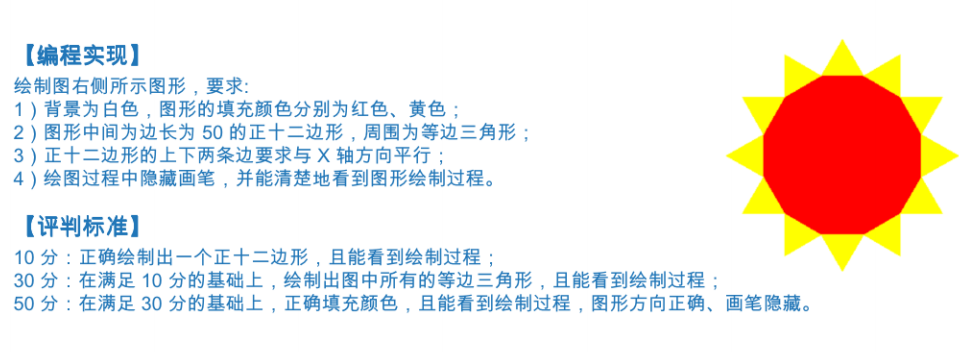

**答案**
```py
import turtle
t = turtle.Pen()
t.pencolor("yellow")
t.right(60)
t.fillcolor("yellow")
t.begin_fill()
for i in range(12):
    t.forward(50)
    t.left(120)
    t.forward(50)
    t.right(90)
t.end_fill()
t.left(60)

t.pencolor("red")
t.fillcolor("red")
t.begin_fill()
for i in range(12):
    t.forward(50)
    t.left(30)
t.end_fill()

turtle.done()


```
-----

# 2. 一月份-19.1月19日-Python求和

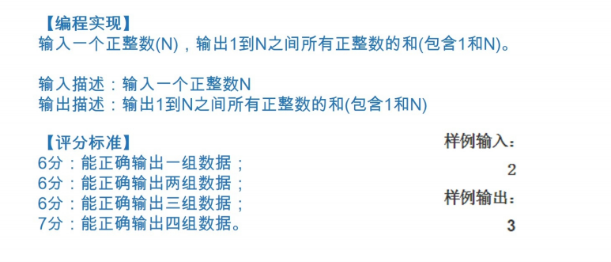


答案

>```py
>a = int(input())
>sum = 0
>for x in range(1,a+1):
>    sum = sum + x
>print(sum)
>
>```
>


-----

# 3. 一月份-11.1月11日-Python奇偶数

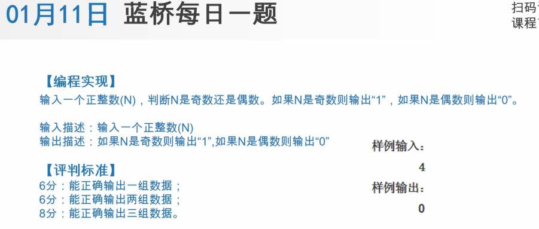


答案

>```py
>a = int(input())
>if a%2 ==0:     #除以2，偶数余数是0
>    print("0")
>else:
>    print("1")
>
>```
>

-----
# 4. 一月份-27.1月27日-Python单词频次

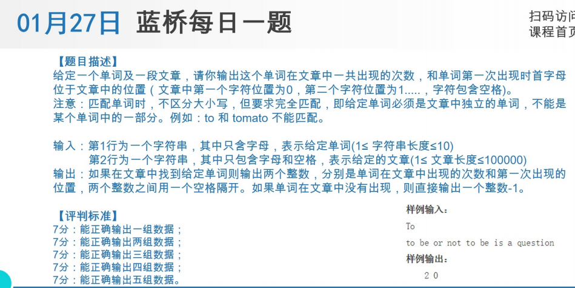


答案

>```py
>
>a = input()
>b = input()
>
># a = 'To'
># b = 'to be or not to be is a question'
>a = a.upper()                  # 统一成 大写字母的单词
>b = b.upper()
># print(a.upper()) #
># print(b.upper())
>b2 = b.split(" ")
>b3 = b2.copy()
># print(b2)
>cs = 0
>for x in range(len(b3)):
>    if a in b3:                # 如果 a 在列表b3 成立。
>        cs  = cs +1            # 出现次数 +1
>        b3.remove(a)
># print("次数",cs)
># print("第1次出现位置",b2.index(a))
>
>if cs ==0:
>    print("-1")
>else:
>    print("{} {}".format(cs,b2.index(a)))
>
>
>
>
>
>
>```
>

-----
# 5. 一月份-3.1月3日-Python字符串

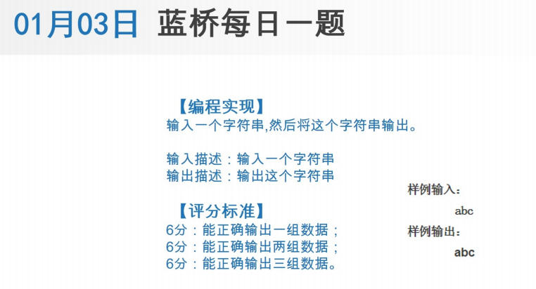


答案

>```py
>
>a = input()
>print(a)
>
>
>```
>
-----
-----
# 6. 七月份-19.7月19日-Python电梯

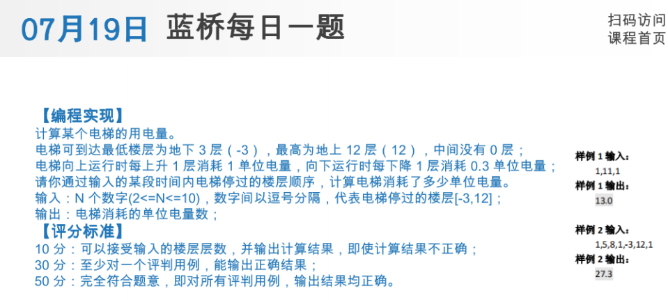


答案

>```py
>b = [1,11,1]
>b = eval(input())               # 自动转换数据格式
>
>a = []                          # 存楼层
>for x in b:
>    if x >0:
>        a.append(x-1)
>    else:
>        a.append(x)
>#print(a)
>
>
>move = []                       # 分别移动了几层
>for x in range(len(a)-1):
>    move.append(a[x+1] - a[x])
>
>#print(move)
>d = []                          #电费列表
>for x in move:
>    if x > 0:
>        d.append(x)
>    else:
>        #print(x)
>        d.append(-0.3*x)        # x是负数需要 结果要加 减号
>
>print(sum(d)) #sum 求和
>
>
>
>
>
>```
>
-----
-----
# 7. 七月份-27.7月27日-Python邮箱密码

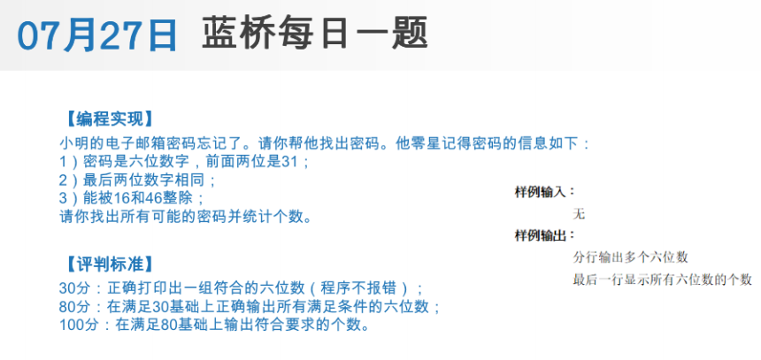


答案

>```py
>
>num = 0
>for x in range(310000,320000):
>    if x % 100 % 11 == 0 and x % 16 == 0 and x % 46 ==0:
>        # x % 100 求的是 后2位的内容
>        # x % 100 % 11 后2位的内容是相等，必定是 11、22、33...这样的，除以11,余数是0
>        num =num+1
>        print(x)
>print(num)
>
>
>```
>
-----
-----
# 8. 七月份-3.7月3日-Python打印字母

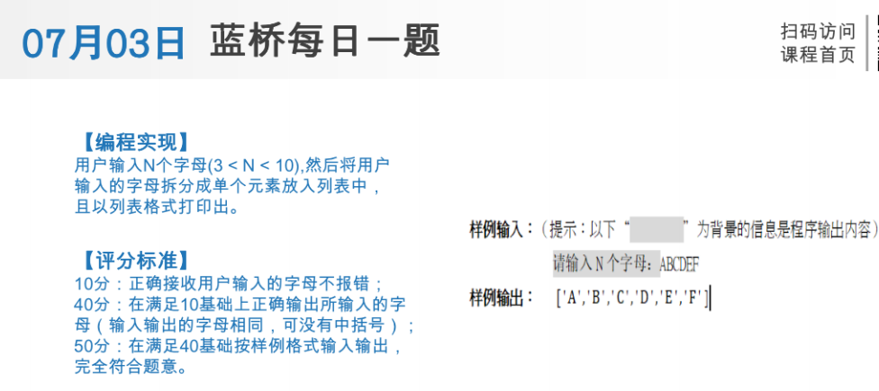


答案

>```py
>
>L = input("请输入N个字母")
>L2 = list(L)
>print(L2)
>
>```
>
-----
-----
# 9. 三月份-11.3月11日-Python体重指数

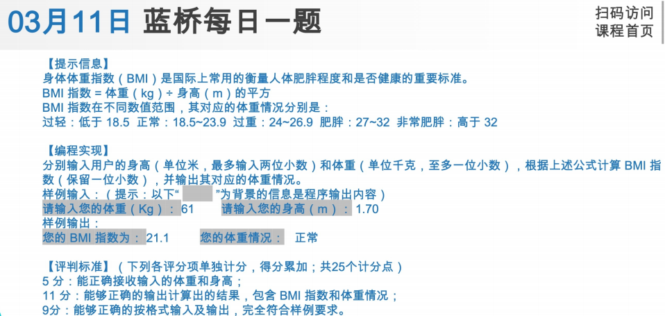


答案

>```py
>
>w = float(input("请输出您的体重 (kg) : "))
>h = float(input("请输出您的身高 (m) : "))
>bmi = w/h**2
>bmi2 = int(bmi*10)     # 小数点右移1位，取整后，小数点往左1位恢复.
>bmi3 = float(bmi2/10)
>print("您的 BMI 指数为 "+str(bmi3))
>
>if bmi3 < 18.5:
>    print("您的体重情况："+"过轻")
>elif 18.5 <= bmi <= 23.9:
>    print("您的体重情况："+"正常")
>elif 24 <= bmi <= 26.9:
>    print("您的体重情况："+"过重")
>elif 27 <= bmi <= 32:
>    print("您的体重情况："+"肥胖")
>elif 32 < bmi:
>    print("您的体重情况："+"非常肥胖")
>
>
>```
>
-----
-----
# 10. 三月份-19.3月19日-Python约分

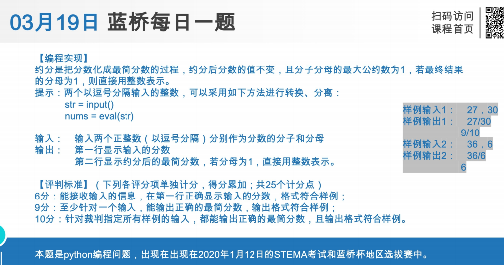


答案

>```py
>
>str = input("输入两个正整数（以逗号分隔）分别作为分数的分子和分母：")
>str = eval(str)
>a = str[0]
>b = str[1]
>print("{}/{}".format(a,b))
>if a > b:
>    n = b
>else:
>    n = a
>
>for i in range(2,n+1):
>    if a%i == 0 and b%i ==0: #同时被 i 整除时，约分
>        a = a//i
>        b = b//i
>if b == 1:
>    print(a)
>else:
>    print("{}/{}".format(a, b))
>
>
>```
>
-----
-----
# 11. 三月份-27.3月27日-Python绘图

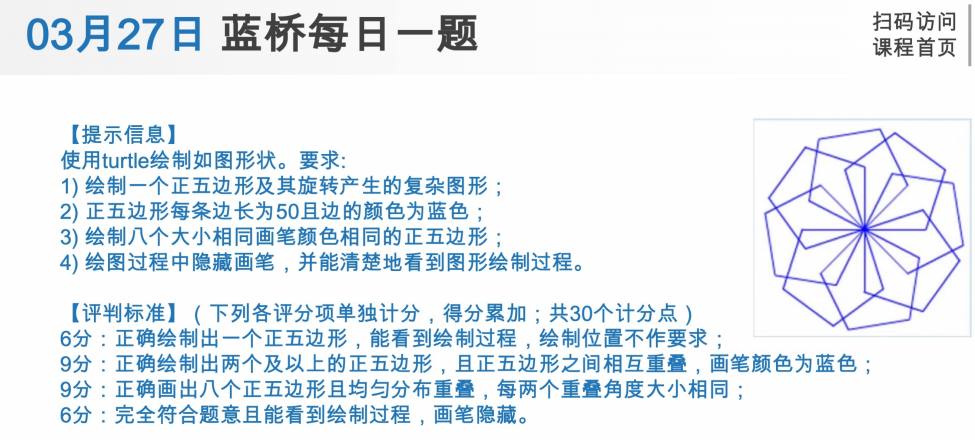


答案

>```py
>
>import turtle
>turtle.color("blue")
>turtle.hideturtle()
>for x in range(8):
>    for i in range(5):
>        turtle.left(72)
>        turtle.forward(50)
>    turtle.left(45)
>turtle.done() # 防止窗口关闭
>
>
>```
>
-----
-----
# 12. 三月份-5.3月5日-Python排列组合

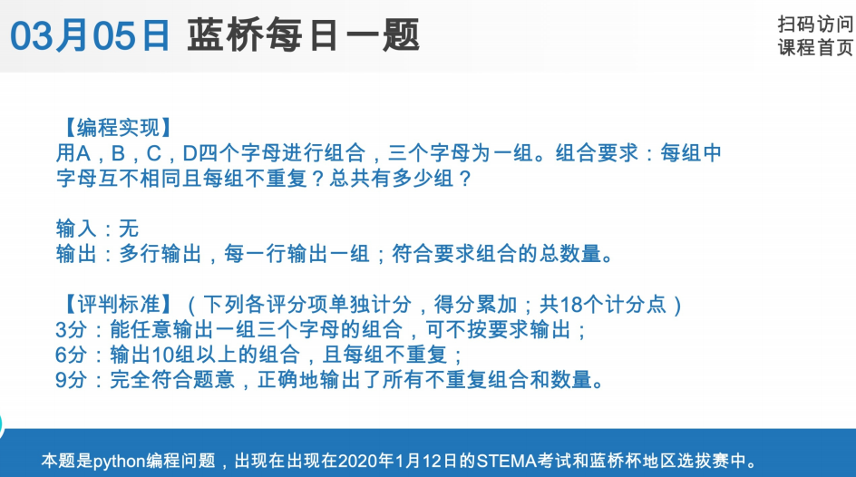


答案

>```py
>
>a = 0
>b = ["A","B","C","D"]
>for x in b:
>    for y in b:
>        for z in b:
>            if x != y and y !=z and z!=x:
>                print(x+y+z)
>                a = a + 1
>print(a)
>
>
>```
>
-----
-----
# 13. 九月份-11.9月11日-Python买鸡

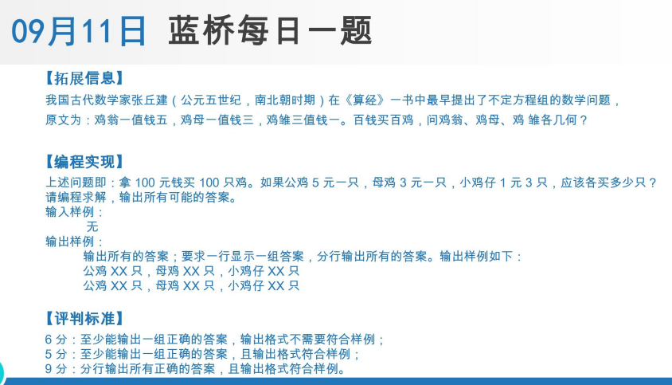


答案

>```py
>
>for xjz in range(100):
>    for mj in range(100-xjz):
>        gj=int((100-xjz-mj*3)/5)
>        if (100-xjz-mj*3)%5 == 0  and gj > -1: #公鸡数是整数、数量不能为负数才成立。
>            print("公鸡{}只，母鸡{}只，小鸡仔{}只".format(gj,mj,xjz))
>
>
>
>
>```
>
-----
-----
-----
-----

-----
-----
-----
-----
-----
-----
-----
-----
-----
-----
-----
-----
-----
-----
-----
-----
-----
-----
-----
-----
-----
-----
-----
